# 🌟 Personal Simple Frontend Projects

**📅 Duration:** 300 hours  
**📖 Course:** Responsive Web Design - FreeCodeCamp

## 🌐 Live Projects 
- [Product Landing Page](https://product-landing-page-example.netlify.app/)
- [Tribute to Alan Turing Page](https://tribute-alanturing-page.netlify.app/)
- [Survey Form](https://survey-form-myexample.netlify.app/)
- [Technical Linux Documentation Page](https://technical-documentation-linux-page.netlify.app/)

## 📖 Description
This repository contains a collection of simple frontend projects created as part of the Responsive Web Design course offered by FreeCodeCamp. These projects showcase my skills, creativity, and understanding of web development concepts.

## 🎨 Features
- **Responsive Design:** Fully responsive layouts that adapt to various screen sizes, ensuring a great user experience on all devices.
- **Modern Aesthetics:** Clean and modern design principles, incorporating best practices in UI/UX.
- **Project Showcase:** Highlights various projects completed, demonstrating abilities and growth as a developer.
- **Contact Section:** Allows potential employers or collaborators to reach out easily (if applicable).

## 🛠️ Technologies Used
- **HTML5:** Markup language for structuring the content.
- **CSS3:** Styling language to create visually appealing layouts and designs.
- **Flexbox:** Used for responsive layouts to ensure elements are aligned and spaced correctly.
- **Media Queries:** For creating responsive design adjustments based on different screen sizes.

## 🚀 Getting Started
To view the projects, open the corresponding `index.html` files in your web browser.

## 📷 Preview

### Personal Portfolio (demo)
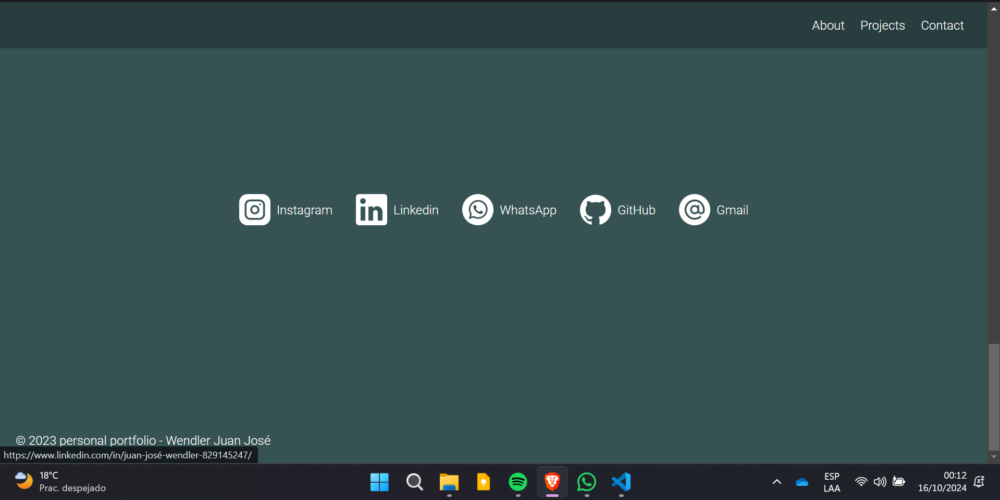
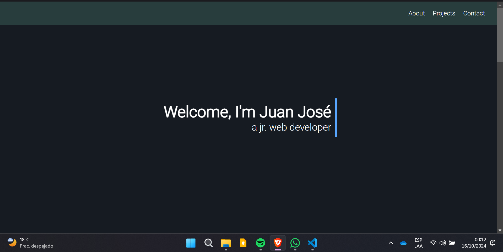
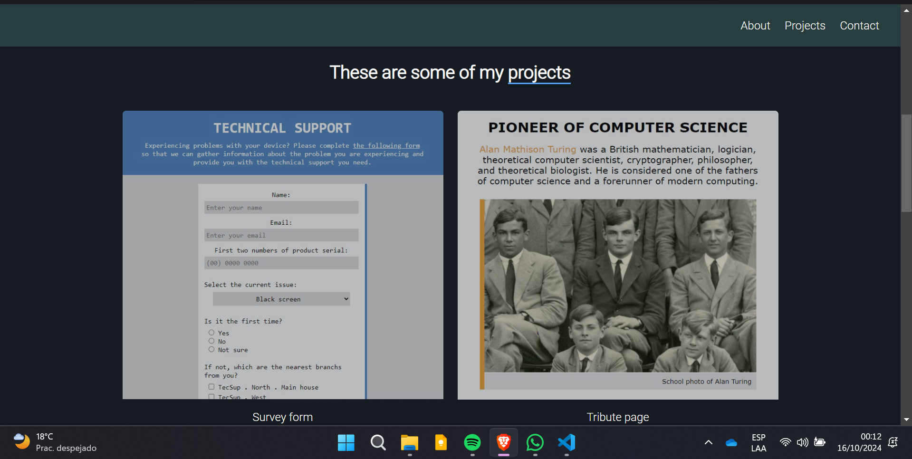
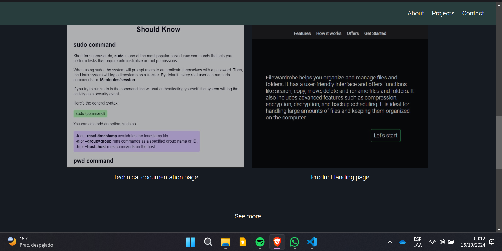

### Product Landing Page
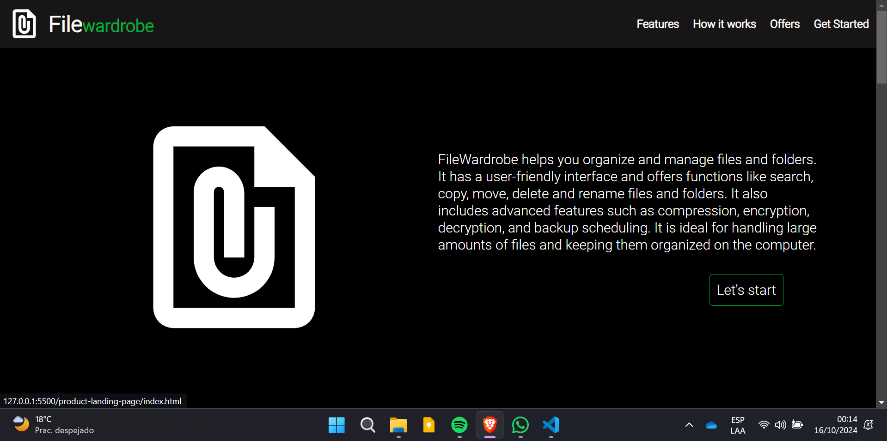
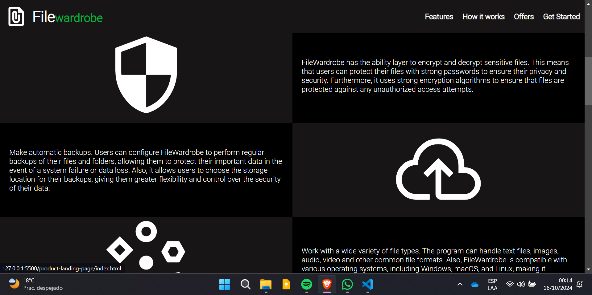
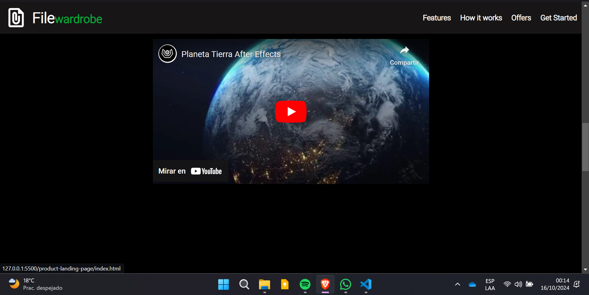
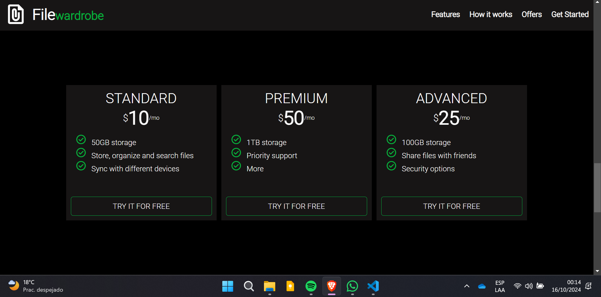
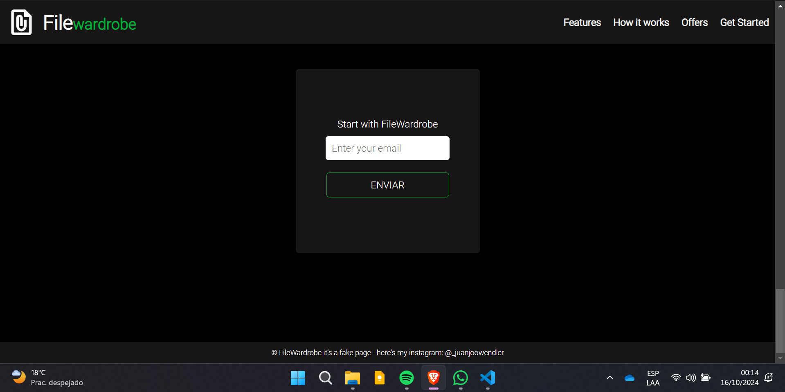

### Survey Form
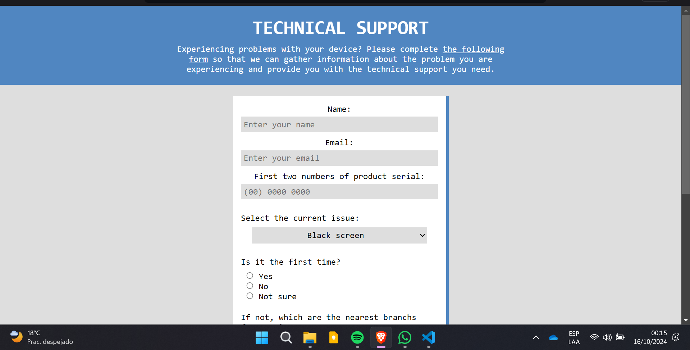
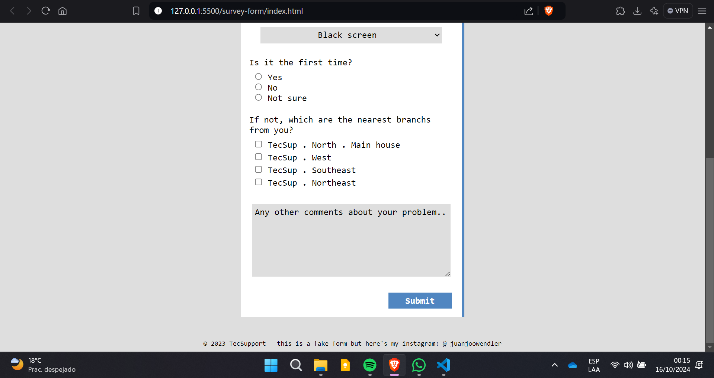

### Technical Linux Documentation Page
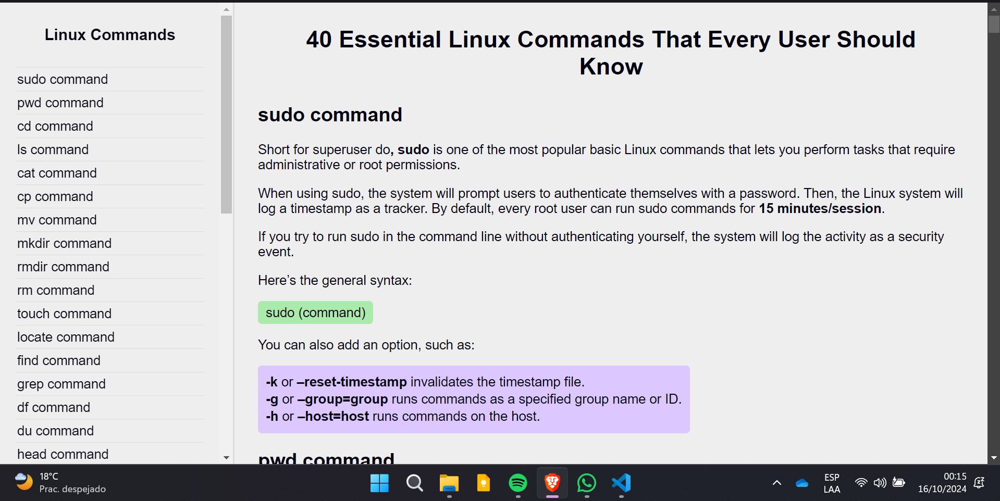
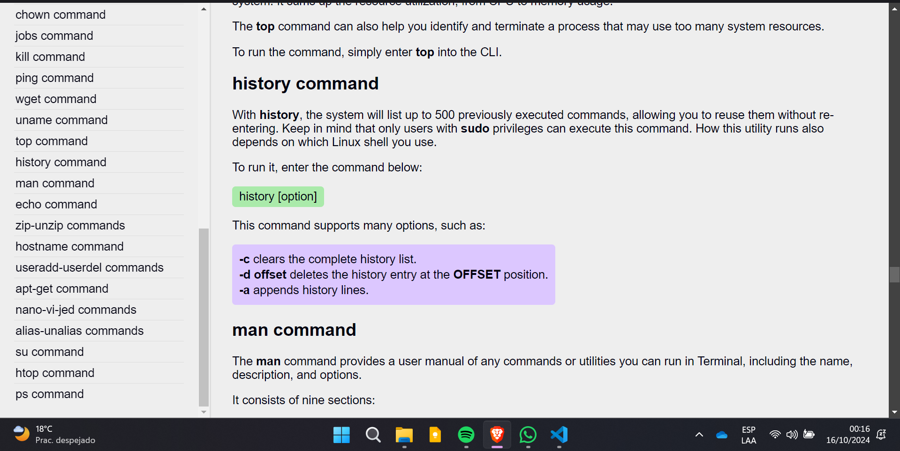

### Tribute to Alan Turing Page
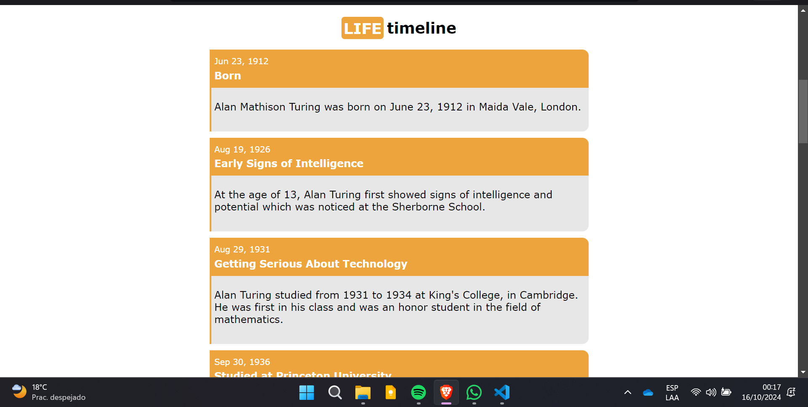
